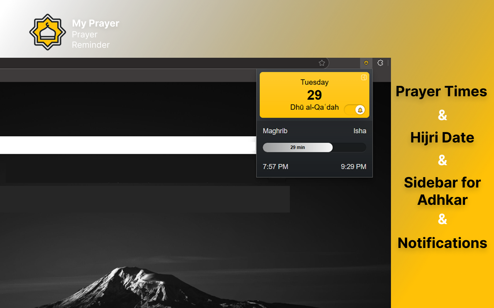

# My Prayer Extension

  
  
  <h3>Your Personal Prayer Companion</h3>
  
  

    

      
      
<em>Main Interface</em>

    

    

      
      
<em>Azkar Sidebar</em>

    

  

  <strong>My Prayer</strong> is a browser extension designed to provide prayer times based on your current geographical location.

## ✨ Features

### 🕒 Prayer Times
- **Automatic Prayer Times**: Fetches prayer timings based on your geographic location
- **Multiple Calculation Methods**: Get calculation method based on your geographic location
- **Prayer Times Sidebar**: Access a comprehensive view of all prayer times with highlighted upcoming prayer

### 📅 Calendar & Notifications
- **Hijri Date**: Displays Hijri calendars for convenience
- **Prayer Notifications**: Receive notifications when prayer times occur (toggle on/off)

### 📿 Adhkar
- **Morning and Evening Adhkar**: 
  - Complete collection of morning and evening remembrances
  - Counter for each zekr to track your daily recitations
  - Reset functionality for counters
  - Virtues (fadl) of each zekr displayed
  - Easy navigation between different adhkar

## 🚀 Planned Features

### ⏰ Prayer Features
- **Adhan to Iqamah Timer**: A timer between Adhan and Iqamah to help users prepare for prayers
- **Extended Prayer Times**:
  - Addition of midnight prayer time

### ⚙️ Customization
- **Comprehensive Options Page**:
  - Customizable prayer notifications (enable/disable for specific prayers)
  - Prayer time calculation method selection
  - General extension preferences
- **Theme Customization**:
  - Light/Dark theme toggle

## 📥 Installation

1. Download the extension files from [here](https://github.com/mahmouddwidar/My-Prayer/archive/refs/heads/main.zip) or clone the repo
2. Open your browser and go to the extensions management page (e.g., chrome://extensions/ for Chrome)
3. Enable Developer mode
4. Click on "Load unpacked" and select the downloaded extension folder

## 🌐 Download

You can download the My Prayer extension from:
- **Edge:** [My Prayer on Microsoft Edge](https://microsoftedge.microsoft.com/addons/detail/my-prayer/kfifklbdcpifbkeebmieolhfnkkepbgk?hl=en-US)

## 📝 Usage

Once installed, the extension automatically detects your location to provide prayer times. You can view the prayer times, dates, and get calculation methods based on your location.

## 📋 Changelog

### Version 1.2.0 (Latest)
#### 🆕 New Features
- **Prayer Times Sidebar**
  - Comprehensive view of all prayer times
  - Highlighted upcoming prayer time
  - Easy access to detailed prayer schedule

- **Morning and Evening Adhkar**
  - Complete collection of morning and evening remembrances
  - Counter system for tracking zekr recitations
  - Reset functionality for counters
  - Virtues (fadl) of each zekr
  - User-friendly interface for adhkar navigation

### Version 1.1.0
#### 🔔 Notification Updates
- **Added Notification Toggle Button**  
  - New switch to enable/disable prayer time notifications  
  - Saves preference in local storage  
  - Clear UI feedback for on/off states  

## 🤝 Contribution

The repository is open for contributions! Feel free to:
- Fork this project
- Suggest new features
- Report issues
- Submit pull requests

### 🎨 Design Resources
- **Figma Design**: Check out our [Figma Design File](https://www.figma.com/design/bgkUGMAzLRUbiL1w3A9s3f/My-Prayer-Extension?node-id=0-1&m=dev&t=h11LdWPBNSoe6juB-1) for design guidelines and UI components
- Follow the design system and components when contributing new features
- Maintain visual consistency across the extension

All contributions are welcome!

## 📄 License

This project is licensed under the MIT License.
